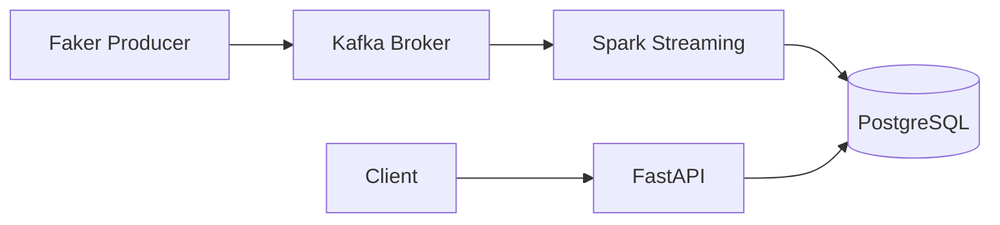

<p align="center">
  <picture>
    <source media="(prefers-color-scheme: dark)" srcset="https://img.shields.io/badge/Clickstream_Pipeline-1E1E1E?style=for-the-badge&logo=apachekafka&logoColor=white">
    
  </picture>
</p>

<p align="center">
  <a href="https://www.python.org/">
    
  </a>
  <a href="https://kafka.apache.org/">
    
  </a>
  <a href="https://spark.apache.org/">
    
  </a>
  <a href="https://fastapi.tiangolo.com/">
    
  </a>
  <a href="https://www.postgresql.org/">
    
  </a>
  <a href="https://www.docker.com/">
    
  </a>
  <a href="LICENSE">
    
  </a>
  <a href="https://github.com/amori27/data-engineering-portfolio/actions">
    
  </a>
</p>

<p align="center">
  <b>Real-time clickstream analytics pipeline</b> — Kafka → Spark Structured Streaming → PostgreSQL → FastAPI
  <br>
  Simulate, ingest, aggregate, and query web pageview events at scale.
</p>

---

## Problem

Building a real-time analytics pipeline is complex. You need to:

- Ingest high-throughput event streams reliably
- Process and aggregate data with low latency
- Store results for interactive querying
- Expose insights via a clean API

This project solves all four with a production-ready, containerized stack.

## Features

- **Real-time ingestion** — Kafka producer generating 10+ realistic pageview events/second
- **Streaming aggregation** — Spark Structured Streaming computing 1-minute windowed metrics
- **Interactive API** — FastAPI with pagination, country filtering, and OpenAPI docs
- **Containerized infrastructure** — Kafka, Zookeeper, PostgreSQL via Docker Compose
- **Graceful shutdown** — Producers flush pending messages; streaming checkpoints progress
- **Configurable** — All parameters via environment variables
- **Tested** — Comprehensive test suite with CI/CD

## Architecture



| Component | Technology | Role |
|---|---|---|
| **Producer** | Python + confluent-kafka | Generates and publishes pageview events |
| **Message Broker** | Kafka 3.6 | Buffers and distributes events |
| **Stream Processor** | Spark Structured Streaming | Windowed aggregation (1-min) |
| **Storage** | PostgreSQL 16 | Raw events + aggregated metrics |
| **API** | FastAPI 0.115 | REST endpoints for analytics |

## Quick Start

```bash
# Prerequisites: Python 3.11+, Docker, Java 11+ (for Spark)

# 1. Clone and setup
git clone https://github.com/amori27/data-engineering-portfolio.git
cd data-engineering-portfolio
make setup

# 2. (Terminal 1) Start the event producer
make producer

# 3. (Terminal 2) Start Spark Streaming
make streaming

# 4. (Terminal 3) Start the API
make api
```

## API Endpoints

| Method | Endpoint | Description |
|---|---|---|
| GET | `/api/health` | Health check |
| GET | `/api/pageviews/recent?limit=50` | Most recent pageviews |
| GET | `/api/pageviews/top-pages?min_views=1` | Top pages by view count |
| GET | `/api/pageviews/country-breakdown` | Views per country |
| GET | `/api/pageviews/country/{code}?limit=50` | Pageviews by country |

```bash
# Example queries
curl http://localhost:8000/api/health
curl "http://localhost:8000/api/pageviews/recent?limit=10"
curl http://localhost:8000/api/pageviews/top-pages
curl http://localhost:8000/api/pageviews/country-breakdown
curl http://localhost:8000/api/pageviews/country/US
```

OpenAPI docs at [http://localhost:8000/docs](http://localhost:8000/docs)

## Configuration

All configuration is via environment variables. Copy `.env.example` to `.env` and adjust:

| Variable | Default | Description |
|---|---|---|
| `KAFKA_BOOTSTRAP_SERVERS` | `localhost:9092` | Kafka broker address |
| `KAFKA_TOPIC` | `pageviews` | Kafka topic name |
| `PRODUCER_EVENTS_PER_SECOND` | `10` | Event generation rate |
| `PRODUCER_MAX_EVENTS` | `0` | Max events (0 = unlimited) |
| `POSTGRES_HOST` | `localhost` | PostgreSQL host |
| `POSTGRES_DB` | `analytics` | Database name |
| `API_HOST` | `0.0.0.0` | API bind address |
| `API_PORT` | `8000` | API port |

## Project Structure

```
clickstream-pipeline/
├── src/
│   ├── producer/          # Kafka event generator
│   │   ├── main.py        # Producer entrypoint with graceful shutdown
│   │   ├── generator.py   # Event data model and Faker generation
│   │   └── config.py      # Producer configuration
│   ├── streaming/         # Spark Structured Streaming
│   │   ├── main.py        # Streaming job with windowed aggregation
│   │   └── config.py      # Streaming configuration
│   └── api/               # FastAPI serving layer
│       ├── main.py        # App factory with middleware
│       ├── routes.py      # REST endpoints
│       ├── database.py    # PostgreSQL connection management
│       └── config.py      # API configuration
├── tests/                 # Test suite
│   ├── test_generator.py  # Producer event tests
│   └── test_api.py        # API endpoint tests
├── config/                # Infrastructure configuration
│   ├── init.sql           # PostgreSQL schema
│   └── logging.conf       # Logging configuration
├── docs/                  # Documentation
│   ├── architecture.md    # System architecture
│   └── deployment.md      # Deployment guide
├── scripts/               # Utility scripts
│   └── setup.sh           # One-shot project setup
├── docker-compose.yml     # Kafka, Zookeeper, PostgreSQL
├── pyproject.toml         # Project metadata and dependencies
├── Makefile               # Common commands
├── .env.example           # Environment template
└── .github/workflows/     # CI pipeline
```

## Testing

```bash
# Run all tests
pytest tests/ -v

# With coverage
pytest tests/ -v --cov=src --cov-report=term-missing

# Run specific test file
pytest tests/test_generator.py -v
```

## Roadmap

- [x] Core pipeline (producer, streaming, API)
- [x] Docker Compose infrastructure
- [x] CI/CD pipeline
- [x] Comprehensive documentation
- [ ] Schema registry integration
- [ ] Exactly-once semantics in streaming
- [ ] Real dashboard (Grafana)
- [ ] Kubernetes deployment manifests
- [ ] Data quality checks (Great Expectations)
- [ ] Metrics and monitoring (Prometheus)

## FAQ

<details>
<summary>Why Kafka instead of a message queue?</summary>

Kafka offers higher throughput, fault tolerance, and replayability — ideal for event streaming pipelines.
</details>

<details>
<summary>Can I use this in production?</summary>

The architecture is production-ready, but you should replace the local Spark session with a cluster deployment, add SSL to Kafka, and use managed PostgreSQL.
</details>

<details>
<summary>How do I change the aggregation window?</summary>

Set `window_duration` and `trigger_interval` in `src/streaming/config.py` or pass them via environment variables.
</details>

## Performance Notes

- The producer generates ~10 events/second by default. Increase `PRODUCER_EVENTS_PER_SECOND` for load testing.
- Spark streaming uses `local[*]` by default. For production, deploy on a cluster.
- PostgreSQL is configured with appropriate indexes on `event_timestamp` and `country`.
- The API uses connection-per-request pattern. For high throughput, add PgBouncer.

## Security Considerations

- Never commit `.env` files. API keys and passwords are for local development only.
- Kafka PLAINTEXT is used locally. Use SSL in production.
- PostgreSQL runs without SSL locally. Enable SSL in production.
- The API has no authentication layer. Add API keys or OAuth for production.

## Contributing

See [CONTRIBUTING.md](CONTRIBUTING.md) for setup instructions and contribution guidelines.

## License

[MIT](LICENSE) © 2026 Ameer Asaad
