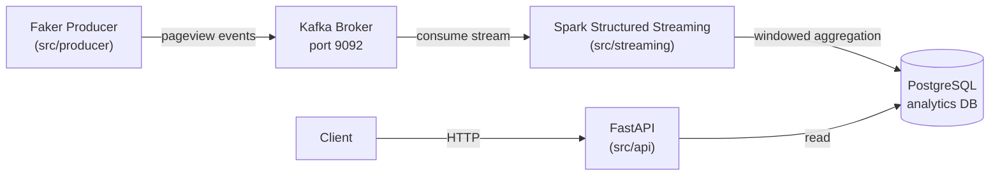

# Architecture

## System Overview

## Data Flow

1. **Producer** generates realistic pageview events at a configurable rate using Faker
2. Events are published to a Kafka topic with the session_id as the message key
3. **Spark Structured Streaming** reads from Kafka, parses the JSON, computes 1-minute windowed aggregations (view_count, unique_users per page_url)
4. Aggregated results are written to PostgreSQL via JDBC
5. **FastAPI** exposes REST endpoints for querying raw events and aggregated analytics

## Component Details

### Producer
- Rate-limited event generation (configurable via `PRODUCER_EVENTS_PER_SECOND`)
- Idempotent producer with exactly-once delivery semantics
- Graceful shutdown with pending message flush

### Streaming
- Spark Structured Streaming with exactly-once guarantees
- Watermark-based late data handling (1 minute)
- Micro-batch trigger every 30 seconds
- foreachBatch sink writing to PostgreSQL

### API
- FastAPI with auto-generated OpenAPI docs at `/docs`
- Connection pooling via psycopg2
- Pagination on all list endpoints

### Database
- PostgreSQL 16 running in Docker
- Schema auto-initialized via init.sql
- Indexes on frequently queried columns
